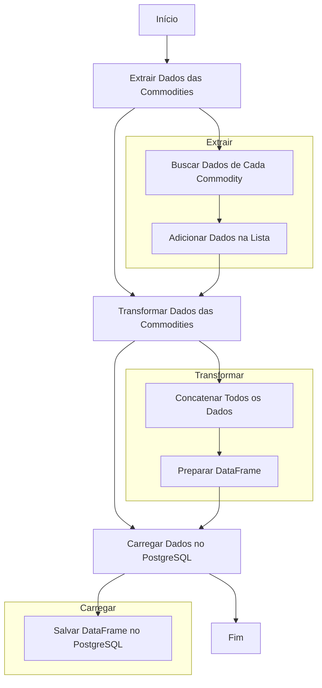

# DW_dbt_sql_st

Este repositório contém o código-fonte do meu projeto de extração, transformação e carga de dados (ETL) que faz conexão com um banco de dados PostgreSQL na AWS via RDS.

O objetivo do projeto é extrair dados de commodities do Yahoo Finance, transformá-los em uma estrutura adequada e carregá-los em um banco de dados PostgreSQL na AWS via RDS.

O projeto utiliza as seguintes tecnologias:

* dbt: um framework de transformação de dados que permite definir e executar modelos de dados em diferentes ambientes.
* Render: um serviço de deploy de aplicações web que permite hospedar e executar aplicações web em um ambiente de produção.
* Streamlit: uma biblioteca Python que permite criar aplicações web interativas com facilidade.

O código-fonte está organizado em dois diretórios principais:

* `src`: contém o código-fonte do projeto, incluindo as funções de extração, transformação e carga de dados.
* `dbt_project`: contém o projeto dbt, incluindo os modelos de dados e as transformações.

Para executar o projeto, basta executar o comando `python src/extract_load.py` no diretório raiz do projeto. Isso irá extrair os dados do Yahoo Finance, transformá-los e carregá-los no banco de dados PostgreSQL na AWS via RDS.

O projeto também inclui um dashboard feito com Streamlit que permite visualizar os dados e realizar análises.

